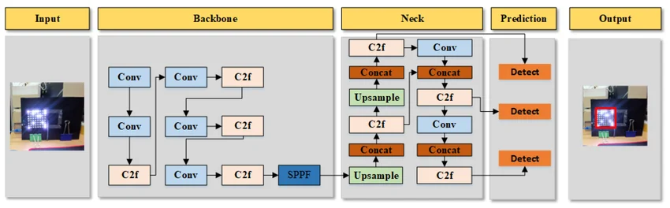

# Dataset
**Dataset de Desidentificación de Radiografías**

**Descripción**
Este dataset ha sido creado para tareas de desidentificación automática de imágenes médicas, concretamente radiografías en formato PNG.
El objetivo principal es detectar información sensible incrustada en las imágenes mediante técnicas de detección de objetos utilizando el formato de anotación YOLO.
Las anotaciones contienen bounding boxes alrededor de texto sensible presente en las radiografías, permitiendo posteriormente aplicar técnicas de anonimización u OCR seguro.

**Tipo de imágenes**
* Radiografías médicas
* Formato de imagen: .png

**Formato de anotaciones**
Las anotaciones siguen el formato estándar YOLO:
<class\_id> <x\_center> <y\_center> <width> <height>
Donde:
* **class\_id:** identificador numérico de la clase
* **x\_center:** coordenada X del centro de la caja (normalizada entre 0 y 1)
* **y\_center:** coordenada Y del centro de la caja (normalizada entre 0 y 1)
* **width:** ancho de la caja (normalizado entre 0 y 1)
* **height:** alto de la caja (normalizado entre 0 y 1)
Ejemplo:
0 0.512 0.183 0.245 0.052

**Clases**

ID	Clase
0	name
1	id
2	age
3	date
4	time

**Estructura del dataset**
├── data.yaml
├── Readme.md
├── images/
│   ├── train/
│   └── val/
└── labels/
    ├── train/
    └── val/
images/: contiene las radiografías en formato PNG.
labels/: contiene las anotaciones YOLO (.txt) correspondientes a cada imagen.
Cada imagen tiene un fichero .txt asociado con el mismo nombre.
Ejemplo:
images/train/ed9c0dfc-ea25b576-0f8cc069-df4cdf14-0cd60eb7.png
labels/train/ed9c0dfc-ea25b576-0f8cc069-df4cdf14-0cd60eb7.txt

**División del dataset**
El dataset contiene aproximadamente:
* 400 imágenes en total
* 80% para entrenamiento (train)
* 20% para validación (val)
Distribución:
* Train: \~320 imágenes
* Validation: \~80 imágenes


**Uso previsto**
Este dataset está diseñado para:
* Desidentificación automática de radiografías
* Detección de información sensible en imágenes médicas
* Entrenamiento de modelos
* Investigación en privacidad y anonimización médica


**Consideraciones**
* Las coordenadas están normalizadas siguiendo el estándar YOLO.
* Las imágenes contienen información sensible delimitada mediante bounding boxes.
* El dataset está orientado a tareas de detección de objetos y anonimización automática.
* El conjunto de datos esta formado por imágenes reales y datos sintéticos, permitiendo conservar la privacidad y anonimización de los pacientes.

# Arquitectura YOLOv8

## Arquitectura del Sistema y de la Red Neuronal

Implementamos una solución de extremo a extremo, enfocada para la reproducibilidad y una arquitectura de visión artificial basada en YOLOv8.

### 1. Arquitectura de Software

El proyecto se ha desacoplado deliberadamente en componentes independientes para garantizar la mantenibilidad, escalabilidad y separación de responsabilidades:
* **Capa de Datos e Ingesta (`data.yaml`):** Centraliza las rutas de los conjuntos de entrenamiento/validación y el diccionario de clases.
* **Capa de Orquestación (`train.py` & `evaluate.py`):** Aislada del entorno de usuario. Permite re-entrenar el modelo con nuevos datos.
* **Capa de Inferencia (`inference.py`):** Nuestro motor o API local. Centraliza la lógica algorítmica de OpenCV.
* **Capa de Presentación (`app.py`):** Desarrollada con Streamlit. Consume de forma eficiente el core de inferencia y optimiza los recursos de la máquina mediante decoradores de persistencia en memoria.

### 2. Arquitectura de la Red Neuronal

Se ha seleccionado la variante YOLOv8s (Small). Con aproximadamente 11.2 millones de parámetros, ofrece el equilibrio perfecto: es lo suficientemente ligera como para entrenarse con recursos limitados, pero lo suficientemente profunda como para extraer características textuales.

YOLOv8 opera bajo un paradigma de red totalmente convolucional (FCN) de una sola etapa, dividida en tres:



#### A. El Backbone (Extracción de Características): Bloques C2f y Flujo Multiescala
El Backbone es el encargado de transformar los píxeles brutos de la radiografía en mapas de características de alto valor. YOLOv8 utiliza una evolución de la arquitectura CSPDarknet53, cuyo núcleo operativo ha sido rediseñado sustituyendo los antiguos bloques C3 por los nuevos bloques C2f.
##### ¿Cómo funciona el bloque C2f?
El bloque C2f optimiza el flujo de gradientes combinando los principios de las redes ELAN con las conexiones residuales clásicas. Opera de la siguiente manera:
1. **Bifurcación Inicial:** La secuencia de mapas de características entrante se divide en dos ramas tras una convolución inicial.
2. **Flujo Directo:** Una de las ramas salta el procesamiento convolucional profundo y viaja directamente hacia el final del bloque.
3. **Procesamiento en Paralelo (Bottlenecks):** La otra rama atraviesa una serie de bloques Bottleneck (con una convolución ligera de $1 \times 1$ leugo aplican una convolución de $3 \times 3$ para extraer las características geométricas y, finalmente, restauran la dimensión original).
4. **Concatenación y Agregación:** Las salidas de cada uno de los bloques intermedios se van concatenando con el flujo directo original.
##### El Impacto en el Proyecto
* **Preservación de Texturas Finas contra el Desvanecimiento del Gradiente:** En redes convolucionales profundas tradicionales, a medida que avanzamos en las capas, los detalles geométricos extremadamente pequeños tienden a degradarse debido al pooling. Al concatenar constantemente las salidas intermedias, el bloque C2f retiene la información del backbone.
* **Separación de Alto Contraste en Entornos de Bajo Contraste:** Las radiografías presentan transiciones de gris muy suaves que pueden interferir visualmente con las letras. El bloque C2f incrementa la riqueza del gradiente, permitiendo que la red discrimine de forma nítida la tipografía.
* **Eficiencia de Parámetros:** Al dividir y concatenar canales en lugar de simplemente añadir capas más gruesas, el modelo YOLOv8s reduce el número de operaciones de coma flotante (FLOPs).

#### B. El Neck (Fusión de Características): Arquitectura PANet y Propagación Multiescala
YOLOv8 implementa una estructura basada en PANet combinada con bloques C2f. Su objetivo principal es resolver el problema de la pérdida de información mediante una fusión de mapas de características.
##### ¿Cómo funciona la estructura PANet?
A diferencia de las redes piramidales tradicionales (FPN) que solo transmiten información desde las capas más abstractas y profundas hacia las más superficiales, PANet introduce un flujo bidireccional estructurado en dos fases:
1. **Ruta Descendente:** Toma las características semánticas de alta abstracción extraídas en las capas profundas del Backbone y las transfiere hacia abajo, fusionándolas con los mapas de características de baja abstracción de las capas iniciales.
2. **Ruta Ascendente:** Utiliza conexiones directas para acortar la distancia entre las capas inferiores y las superiores. Mediante operaciones de downsampling, reinyecta la información directamente en las capas de alta abstracción.
##### El Impacto en el Proyecto
El texto médico no sigue un patrón de tamaño único. Podemos encontrar un número de `id` o una `date` impresos en una tipografía diminuta en un margen de la imagen, mientras que el `name` del hospital o del paciente puede abarcar un bloque de texto en la cabecera. 
La integración de PANet impacta a través de los siguientes mecanismos:
* **Fusión de Textura e Identidad (Localización Exacta):** Para detectar un texto pequeño, la red necesita píxeles con alta resolución espacial. Sin embargo, para saber a que ser refiere ese texto, necesita el contexto semántico. PANet une ambos: la ruta descendente aporta el "qué es" y la ruta ascendente aporta el "dónde está".
* **Reducción de la Distancia del Gradiente:** La ruta Bottom-Up de PANet crea un atajo, garantizando que las señales de los bordes afilados de los caracteres viajen al final.
* **Invariancia de Escala Real:** Al alimentar los módulos de predicción con mapas de características enriquecidos en múltiples escalas de manera simultánea, el modelo no necesita que el texto esté a una distancia o tamaño fijo. YOLOv8s se vuelve inmune a si en la radiografía el texto se ve pequeño o el texto ocupa un porcentaje mayor.

#### C. El Head (Anclaje y Predicción Découplée): Tareas Especializadas y Regresión Directa
La Head es la etapa final de la red neuronal y el encargado de transformar los mapas de características en predicciones definitivas. YOLOv8 revoluciona este componente al abandonar el diseño unificado tradicional e implementar un Head Desacoplado emparejado con una filosofía de detección Anchor-Free.
##### ¿Cómo funciona el Head Desacoplado y Anchor-Free?
En las versiones anteriores de YOLO, una única capa convolucional final se encargaba de predecir simultáneamente la clase del objeto. YOLOv8 rediseña este proceso mediante dos cambios de paradigma:
1. **Arquitectura Desacoplada (Decoupled Head):** El flujo de datos se divide en dos ramas convolucionales totalmente independientes y especializadas:
   * **Rama de Clasificación ($Cls$):** Se enfoca exclusivamente en determinar las probabilidades de la clase.
   * **Rama de Regresión ($Box$):** Se concentra únicamente en la geometría, calculando las coordenadas exactas del cuadro delimitador.
2. **Filosofía Libre de Anclajes (Anchor-Free):** Los modelos tradicionales necesitaban definir Anchor Boxes previamente calculadas y predecían cuánto se desviaba el objeto de esas formas. Este predice de manera directa el centro geométrico del objeto y calcula cuatro distancias desde ese centro hacia los bordes superior, inferior, izquierdo y derecho.
##### El Impacto en el Proyecto
En la desidentificación de radiografías, el texto sensible suele aparecer de forma compacta y densa. Esta proximidad destruía el rendimiento de los Heads tradicionales. El nuevo Head impacta positivamente de la siguiente manera:
* **Eliminación de Falsos Positivos en Bloques de Texto Densos:** Un problema común en arquitecturas antiguas era que el texto de la clase `date` y el de la clase `time`, al estar pegados, compartían la misma caja de anclaje, confundiendo al modelo. Al predecir directamente desde el centro de cada palabra sin restricciones de cajas rígidas, el modelo separa e identifica cada clase con total independencia.
* **Ajuste Milimétrico de los Bordes del Texto para la Censura:** Para que el algoritmo de OpenCV sea efectivo, la caja debe ceñirse exactamente a los límites del texto. Si la caja se queda corta, quedarán letras visibles y si se pasa destruirá información médica. La regresión Anchor-Free calcula de forma continua y suave la distancia a los bordes, adaptándose perfectamente a palabras cortas o cadenas largas.
* **Funciones de Pérdida Avanzadas:** El Head de regresión utiliza una combinación matemática muy potente para entrenarse:
   * **Complete IoU:** Evalúa no solo el solapamiento de la caja, sino la distancia entre sus centros y la discrepancia en su relación de aspecto.
   * **Distribution Focal Loss:** En lugar de predecir las coordenadas como números fijos, predice una distribución de probabilidad alrededor de los bordes del texto.

# Estructura y explicación de los archivos

## Aplicación Web

Incluimos una interfaz gráfica interactiva que permite cargar radiografías, pasarlas por YOLO entrenado y descargar la imagen procesada.

### Características
* **Carga en caché:** El modelo YOLO se aloja en memoria mediante `@st.cache_resource`.
* **Formatos soportados:** `.png`, `.jpg` y `.jpeg`.
* **Tres técnicas posibles:**
  1. **Pixelado:** Reduce la resolución de la región y la escala de nuevo usando interpolación de vecinos cercanos.
  2. **Borroso:** Aplica un filtro Gaussiano destructivo para emborronar la zona.
  3. **Banda Negra:** Sobrescribe las coordenadas detectadas con un bloque opaco.
* **Descarga:** Permite exportar el resultado en formato PNG.

### Librerías

Dependencias necesarias:

```bash
pip install streamlit ultralytics opencv-python numpy Pillow
```

## Evaluación del Modelo

Contamos con un script que valida el rendimiento del modelo YOLO entrenado utilizando el conjunto de datos de `data.yaml`.

### Características
1. **Métricas:** Calcula la Precisión y el Recall globales.
2. **Control de Calidad:** Selecciona de forma aleatoria 6 imágenes del set de validación y dibuja cajas por colores según la clase detectada.
3. **Reporte:** Exporta de forma local un mosaico visual con los resultados como `val_predictions.png`.

### Ejecución

Se ha de ejecutar:

```bash
python evaluate.py
```

## Inferencia Local

Para procesar imagenes desde la terminal sin necesidad de la interfaz web, se podrá ejecutar `inference.py`. Este archivo permite integrar la anonimización en flujos de trabajo locales.

### Características
* **Modulo:** Contiene una función que recibe la ruta de entrada, la ruta de salida y el método de ocultación de datos.
* **Robustez:** Incluye una verificación previa para comprobar si la imagen existe en el directorio antes de cargar el modelo YOLO.

### Ejecución

Ejecuta el script:

```bash
python inference.py
```

## Requisitos del Entorno

`requirements.txt` contiene las dependencias utilizadas durante el desarrollo.

### Configuración

Recomendamos utilizar un entorno virtual para evitar conflictos:

#### Usando Python
```bash
# 1. Crear el entorno virtual
python -m venv env

# 2. Activar el entorno
# En Linux/macOS:
source env/bin/activate
# En Windows:
.\env\Scripts\activate

# 3. Instalar las dependencias
pip install -r requirements.txt
```

## Entrenamiento

Usamos el archivo train.py para que la red neuronal realize esta tarea de detección de texto médico. 

El script aplica Transfer Learning y desactiva ciertos aumentos de datos geométricos que podrían empeorar lo legible que es el texto.

### Parámetros
* **`epochs=100`**: Ciclos de entrenamiento.
* **`patience=20`**: Early stopping si el modelo no mejora en 20 épocas.
* **`imgsz=1024`**: Garantizar que el texto médico pequeño mantenga suficiente detalle y nitidez.
* **`batch=4`**: Tamaño del lote.
* **Aumentos de Datos Modificados (`fliplr=0`, `flipud=0`)**: Se han desactivado por completo los volteos horizontales y verticales.

### Ejecución

Ejecuta:

```bash
python train.py
```

